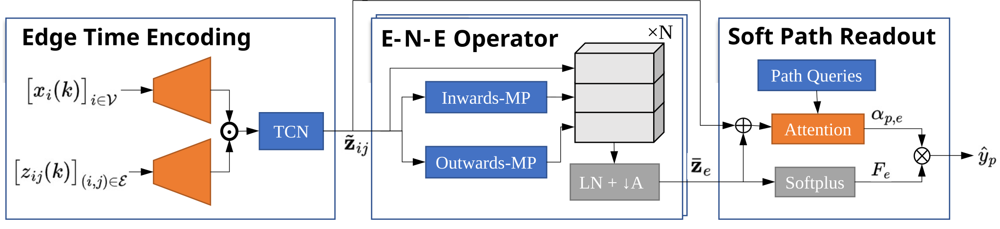

# PathFlowQuery-GNN

### A Spatio-Temporal Learning Approach for Urban Freight Path Flow Estimation

[](paper/PathFlowQuery_GNN_A_Spatio_Temporal_Learning_Approach_for_Urban_Freight_Path_Flow_Estimation.pdf)
[](paper/PathFlowQuery_GNN_A_Spatio_Temporal_Learning_Approach_for_Urban_Freight_Path_Flow_Estimation.pdf)
[](https://www.python.org/)
[](https://pytorch.org/)

Official research code and supplementary material for **PathFlowQuery-GNN (PFQ-GNN)**, a compact and interpretable spatio-temporal graph neural network that estimates urban freight path flows directly from Automatic Vehicle Identification (AVI) detector streams.

**Hongtong Qiu, Jiarui Dong, Zhengyong Gao, Keshuang Tang**<br>
Tongji University · Traffic Management Research Institute of the Ministry of Public Security

> World Conference on Transport Research (WCTR 2026), Toulouse, France, 6-10 July 2026.

[[Paper](paper/PathFlowQuery_GNN_A_Spatio_Temporal_Learning_Approach_for_Urban_Freight_Path_Flow_Estimation.pdf)] [[Poster](paper/海报WCTR.pdf)]

## Overview

Urban freight management requires path-level demand estimates, but real systems usually provide only sparse detector observations and biased, low-frequency GPS traces. PFQ-GNN addresses this underdetermined inverse problem through a calibrated data pipeline and an edge-centric graph architecture:

1. Fuse truck GPS trajectories, AVI records, freight POIs, and the road network.
2. Construct representative OD pairs and up to 20 candidate paths per OD using penalized shortest paths.
3. Build time-varying path-flow priors and use SUMO simulation for controlled data augmentation.
4. Map detector graph sequences directly to nonnegative path-flow predictions with PFQ-GNN.



## Highlights

- **Edge-time encoding.** Detector-node counts and directed-edge features are fused with an edge-conditioned gate and a dilated temporal convolutional network.
- **Efficient E→N→E interaction.** Edge information is exchanged through shared source and destination nodes on the original graph, avoiding explicit line-graph construction.
- **Soft path readout.** Learnable path queries attend over edge embeddings to produce fixed-dimensional, nonnegative path-flow estimates.
- **Physics-aware regularization.** Attention entropy reduces brittle solutions, while an edge-adjacency Laplacian encourages spatially continuous corridor patterns.
- **Multi-source calibration.** GPS, AVI, POI, and SUMO data are combined to alleviate sparse supervision and sampling bias.

## Results

Experiments use the Taicang urban freight network in Jiangsu, China: 4,437 nodes, 10,376 directed links, 1,735 AVI-covered links, 4,200 graph samples, 256 selected detectors, and 200 target paths. The table reports the paper's repeated cross-validation results.

| Model | WMAE | WRMSE | WMAPE | WMSPE | Parameters |
|---|---:|---:|---:|---:|---:|
| Res3D | 18.42 | 27.13 | 11.28% | 1.49 | 864K |
| **PFQ-GNN** | **17.33** | **25.48** | **10.82%** | **1.36** | **129K** |

Relative to Res3D, PFQ-GNN reduces WMAE by 6.0%, WRMSE by 6.1%, WMAPE by 4.09%, and WMSPE by 9.2%, while using substantially fewer parameters. See the paper for the full evaluation protocol, statistical tests, ablations, and limitations.

## Repository Structure

```text
ODEstimation/
├── model/
│   ├── pathFormerGNN.py             # PFQ-GNN implementation
│   ├── pathFormerGNN_refactored.py  # Documented/refactored implementation
│   ├── res3D.ipynb                  # 3D-CNN baseline and evaluation
│   └── 最大流量生成树.ipynb           # Maximum-flow spanning-tree analysis
├── paper/
│   ├── PathFlowQuery_GNN_*.pdf      # Manuscript
│   ├── 海报WCTR.pdf                  # WCTR 2026 poster
│   └── picture/                     # Architecture and graph figures
├── tools/                           # Vendored SUMO Python tools snapshot
├── trajmap.ipynb                    # GPS preprocessing and HMM map matching
├── PathSetConstruction.ipynb        # OD clustering and candidate-path generation
└── README.md
```

Large observational data, simulation outputs, caches, logs, and trained checkpoints are intentionally excluded from Git.

## Environment

The experiments were developed with Python 3.11 and PyTorch. A typical environment requires:

- PyTorch, torchvision, and torch-scatter
- pandas, NumPy, scikit-learn, and SciPy
- GeoPandas, Shapely, NetworkX, and OSMnx
- Matplotlib and Seaborn
- JupyterLab, gotrackit, and torchsummary
- SUMO for microscopic traffic simulation

Create an isolated environment and install PyTorch/torch-scatter using versions compatible with your CUDA runtime:

```bash
conda create -n pfq-gnn python=3.11 -y
conda activate pfq-gnn

# Install PyTorch and torch-scatter for your CPU/CUDA platform first.
pip install pandas numpy scipy scikit-learn geopandas shapely networkx osmnx
pip install matplotlib seaborn jupyterlab gotrackit torchsummary
```

The repository includes a snapshot of SUMO's Python helper tools under `tools/`, but the SUMO simulator binary must still be installed separately. Set `SUMO_HOME` to your local installation when running simulation-related notebooks.

## Data Preparation

The original GPS/AVI records are not distributed in this repository because of data size and access restrictions. To reproduce the pipeline with authorized data, prepare the following local layout:

```text
data/
├── taicangNet/   # Road-network files and candidate path set
├── rawdata/      # AVI counts, matched movements, and travel times
├── traj/         # Map-matched or raw GPS trajectories
├── sumonet/      # SUMO network and simulation configuration
└── output/       # Intermediate matching and path-flow outputs
```

Before executing the notebooks, update their local file paths to point to your own authorized data. The `data/` directory is ignored by Git to prevent accidental publication of large or restricted datasets.

## Workflow

Run the notebooks in the following order:

### 1. GPS preprocessing and map matching

Open `trajmap.ipynb` to clean freight GPS records, segment trips, perform HMM-based map matching, and recover observed routes and OD endpoints.

### 2. OD and candidate-path construction

Open `PathSetConstruction.ipynb` to cluster spatially similar OD pairs and generate diverse candidate paths with iterative edge penalization.

### 3. Simulation-based augmentation

Use the SUMO network and helper tools in `tools/` to load perturbed path-flow priors and export detector counts, matched volumes, and travel times. Simulation output should remain under `data/` or another ignored working directory.

### 4. Model training and evaluation

- `model/pathFormerGNN_refactored.py` contains the standalone PFQ-GNN architecture.
- `model/res3D.ipynb` contains the Res3D baseline and cross-validation workflow.
- Experiment logs and checkpoints are written locally and are not versioned.

A minimal PFQ-GNN forward pass is available directly in the model file:

```bash
python model/pathFormerGNN_refactored.py
```

The model expects a dense tensor `X` with shape `[B, 3, N, N, T]`:

| Channel | Meaning |
|---:|---|
| 0 | Matched flow on directed detector edges |
| 1 | Observed travel time on directed detector edges |
| 2 | Detector-node flow stored on the diagonal |

The output has shape `[B, P]`, where `P` is the number of target freight paths (200 in the paper).

## Reproducibility Notes

- Paper experiments use 4-hour input windows with four 1-hour steps.
- The reported PFQ-GNN uses hidden size 64, two temporal convolution layers, and three E→N→E blocks.
- Optimization uses Adam with learning rate `3e-4`, weight decay `1e-3`, batch size 32, and up to 500 epochs.
- The loss combines MSE, attention-entropy regularization (`1e-4`), and Laplacian smoothness regularization (`5e-4`).
- Results in the paper use rolling-origin evaluation and repeated cross-validation; consult the manuscript before comparing new runs.
- Random seeds, raw data access, and environment-specific notebook paths must be controlled by the reproducing researcher.

## Citation

If this repository is useful in your research, please cite the paper. Publication metadata below should be updated when the final proceedings record becomes available.

```bibtex
@inproceedings{qiu2026pathflowquery,
  title     = {PathFlowQuery-GNN: A Spatio-Temporal Learning Approach for Urban Freight Path Flow Estimation},
  author    = {Qiu, Hongtong and Dong, Jiarui and Gao, Zhengyong and Tang, Keshuang},
  booktitle = {World Conference on Transport Research (WCTR)},
  year      = {2026},
  address   = {Toulouse, France}
}
```

## Acknowledgements and Third-Party Software

This project uses the SUMO traffic simulation ecosystem. Files under `tools/` are a vendored third-party SUMO tools snapshot and may contain their own notices or licenses; upstream terms continue to apply. The manuscript PDF is distributed under the license stated in the document. No separate license has yet been declared for the original source code in this repository.

## Contact

For questions about the paper or data access, please contact the corresponding author listed in the manuscript.
